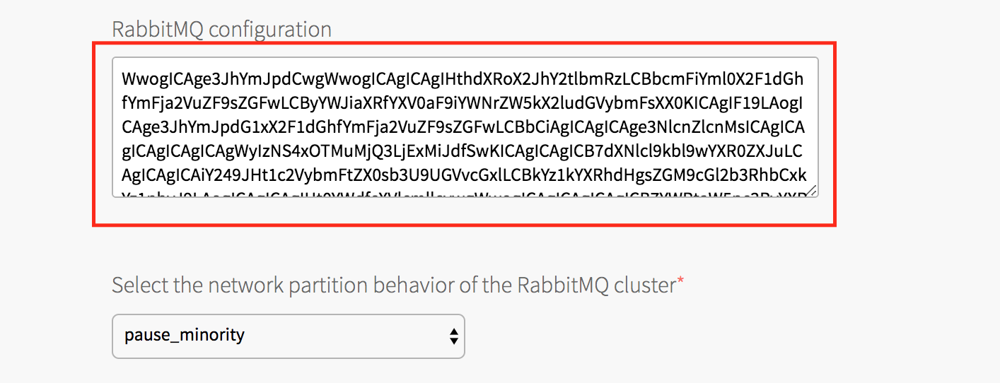

# Configure RabbitMQ for PCF with LDAP Authentication

This guide demonstrates how to set up RabbitMQ for PCF to authenticate and authorize via the LDAP plugin. The below configurations are applicable to 'Only Authentication' scenario, which just configures RabbitMQ to authenticate users via LDAP.

For further configuring RabbitMQ with LDAP to secure vhost access, secure resource (i.e. *exchanges* and *queues*) access and management plugin access, follow the similar steps mentioned in [RabbitMQ integration with LDAP](README.md) for RabbitMQ and LDAP configurations.

As of [RabbitMQ for PCF v1.17](https://docs.pivotal.io/rabbitmq-cf/1-17/index.html), LDAP configuration is supported on Pre-Provisioned Service. LDAP configuration for On-Demand Service is planned to release in future versions.

<!-- TOC START min:2 max:3 link:true asterisk:false update:true -->
- [Prerequisites to follow this guide](#prerequisites-to-follow-this-guide)
- [1. Deploy standalone OpenLDAP server](#1-deploy-standalone-openldap-server)
- [2. LDAP users and groups setup](#2-ldap-users-and-groups-setup)
- [3. Enable LDAP plugin in RabbitMQ for PCF](#3-enable-ldap-plugin-in-rabbitmq-for-pcf)
- [4. Configure LDAP in RabbitMQ for PCF](#4-configure-ldap-in-rabbitmq-for-pcf)
- [4.1. Prepare LDAP configurations](#41-prepare-ldap-configurations)
- [4.2. Convert to Base64](#42-convert-to-base64)
- [4.3. Update RabbitMQ configurations](#43-update-rabbitmq-configurations)
- [5. Save and apply changes](#5-save-and-apply-changes)
- [6. Verify LDAP user can log in](#6-verify-ldap-user-can-log-in)
<!-- TOC END -->


## Prerequisites to follow this guide
The following prerequisites to follow the below steps

- Access to PCF Ops Manager
- Pre-Provisioned Service instance and service key should be created
- `ldapsearch` and `ldap-utils` package should be installed on local/edge machine  

## 1. Deploy standalone OpenLDAP server

We chose to deploy [Pivotal Cloud Foundry](https://pivotal.io/platform) in [Google Cloud Platform](cloud.google.com‎).

Follow these steps to deploy OpenLDAP as separate VM in GCP if LDAP server is not installed and configured.

The below steps configures the base DN for users as 

```
ou=People,dc=datatx,dc=pivotal,dc=io
```

and for user groups

```
ou=Group,dc=datatx,dc=pivotal,dc=io
```

### Install OpenLDAP
If different base DN for users and groups required, please change ldif files under openldap-configs.

1. Login to GCP cloud console and create CentOS 7.x VM of type n1-standard-1 and 20 GB disk space.

2. Open the port `389` which is default non-tls ldap port.

2. Transfer bash script files under scripts directory to newly created VM and install OpenLDAP.

```cmd
chmod +x /openldap-configs/*.sh
sudo ./openldap-configs/install-openldap.sh
```

3. Generate and record SHA hashed password for LDAP admin

```cmd
sudo slappasswd
```

### Configure OpenLDAP

LDAP domain is datatx.pivotal.io which should be translated to various LDAP configs (ldifs) as below

```cmd
dc=datatx,dc=pivotal,dc=io
```

DN for the LDAP admin is

```cmd
cn=ldapadm,dc=datatx,dc=pivotal,dc=io
```


1. Update your Base DN, LDAP admin DN and hashed LDAP admin password in db.ldif and monitor.ldif

2. Deploy db.ldif and monitor.ldif

```cmd
sudo ldapmodify -Y EXTERNAL -H ldapi:/// -f db.ldif
sudo ldapmodify -Y EXTERNAL -H ldapi:/// -f monitor.ldif
```


### Setup OpenLDAP

1. Setup OpenLDAP database 

```cmd
sudo ./openldap-configs/setup-openldap.sh
```

2. Update your Base DN, LDAP admin DN and User DN in base.ldif

```cmd
sudo ldapadd -x -W -D "cn=ldapadm,dc=datatx,dc=pivotal,dc=io" -f base.ldif
```
Enter LDAP admin password when prompted.


## 2. LDAP users and groups setup

`LDAP server` is configured with the following structure

Base DN for users
```
ou=People,dc=datatx,dc=pivotal,dc=io
```

Base DN for user groups

```
ou=Group,dc=datatx,dc=pivotal,dc=io
```

Create users in ldap

Create a rabbitmq-users.ldif with the following contents

```
# user1
dn: cn=nsarvi,ou=People,dc=datatx,dc=pivotal,dc=io
cn: Niranjan
sn: Sarvi
objectClass: inetOrgPerson
userpassword: f1NTSEF9MlYwbnzwZWVwZmJPazJjTHRUbUcwMXdDTE5nNDAwR2E=
uid: nsarvi
mail: nsarvi@pivotal.io

# user2
dn: cn=mrosales,ou=People,dc=datatx,dc=pivotal,dc=io
cn: Marcial
sn: Rosales
objectClass: inetOrgPerson
userpassword: f1NTSEF9MlYwbnzwZWVwZmJPazJjTHRUbUcwMXdDTE5nNDAwR2E=
uid: mrosales
mail: mrosales@pivotal.io
```

Add the users to `ldapserver`

```
sudo ldapadd -h <ldap-server-host> -p <ldap-port> -D "cn=ldapadm,dc=datatx,dc=pivotal,dc=io" -w  -f rabbitmq-users.ldif
```

ldapadd command can be run from remote/edge machine as long as there is connectivity and LDAP port (389 default) is open. Please install the appropriate openldap client packages on remote/edge machine.


Create admin-group-users.ldif as below

```cmd
dn: cn=administrator,ou=Group,dc=datatx,dc=pivotal,dc=io
objectClass: groupofnames
cn: administrator
description: Admin group
member: cn=mrosales,ou=People,dc=datatx,dc=pivotal,dc=io
member: cn=nsarvi,ou=People,dc=datatx,dc=pivotal,dc=io
```

Add users to `administrator` group
```
ldapadd -x -W -D "cn=ldapadm,dc=datatx,dc=pivotal,dc=io" -f admin-group.ldif
```

### Verify LDAP users

```cmd
ldapsearch -h <ldap-server-host> -p <ldap-port> -D "cn=ldapadm,dc=datatx,dc=pivotal,dc=io" -w admin -b "ou=People, dc=datatx,dc=pivotal,dc=io" 'uid=nsarvi'
```
ldapsearch command can be run from remote/edge machine as long as there is connectivity and LDAP port (389 default) is open.


## 3. Enable LDAP plugin in RabbitMQ for PCF
Enable RabbitMQ LDAP plugin by following the below steps

1. Login to Ops Manager
2. Click  RabbitMQ tile  
3. Click Pre-Provisioned RabbitMQ
4. Check the `rabbitmq_auth_backend_ldap`  under `RabbitMQ plugins` as show in the below pic


## 4. Configure LDAP in RabbitMQ for PCF

There are various ways to configure RabbitMQ for authentication and authorization against LDAP.
The below steps represents 'only authentication' against LDAP and fallback to internal database.

## 4.1. Prepare LDAP configurations

The following configurations represents only authentication against LDAP and fallback to internal database.


```
rabbit-auth.config

[
    {rabbit, [
        {auth_backends, [rabbit_auth_backend_ldap, rabbit_auth_backend_internal]}
    ]},
    {rabbitmq_auth_backend_ldap, [
        {servers,               ["<ldap-server>"]},
        {user_dn_pattern,       "cn=${username},ou=People, dc=datatx,dc=pivotal,dc=io"},
        {tag_queries, [
            {administrator,     {constant, true}},
            {management,        {constant, true}}            
        ]},
        {log, network}
    ]}
].


```

For various scenarios on authentication and authorizing resources (vhosts, exchanges, queues), prepare LDAP configurations as mentioned in [RabbitMQ integration with LDAP](README.md)


## 4.2. Convert to Base64

Convert the above configurations to Base64 encoding using openssl.

```
openssl base64 -in rabbit-auth.config -out rabbit-auth-base64.config
```

## 4.3. Update RabbitMQ configurations

Update the Base64 LDAP configurations onto `RabbitMQ Configuration` field on the RabbitMQ tile.

1. Login to Ops Manager
2. Click  RabbitMQ tile  
3. Click Pre-Provisioned RabbitMQ
4. Update RabbitMQ Configuration field with Base64 encoding





## 5. Save and apply changes

## 6. Verify LDAP user can log in

```
curl -u nsarvi:<password> <pcf-rabbitmq-http-api-uri>/overview | jq
```


LDAP users can log-in to RMQ management UI as well.
